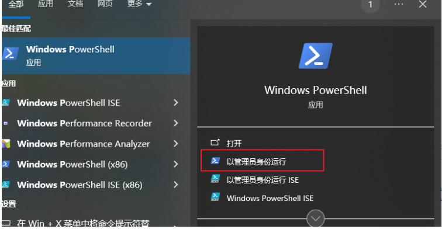
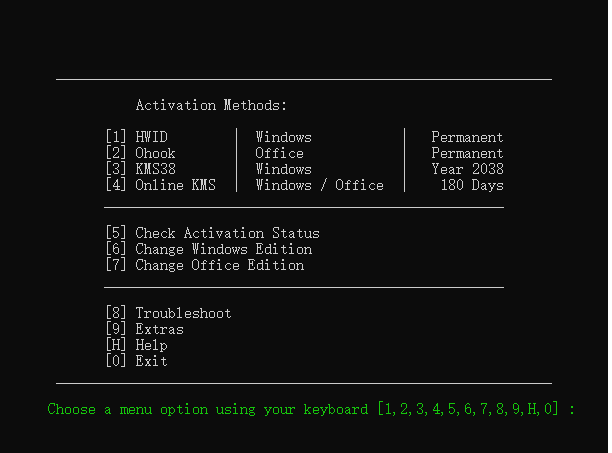
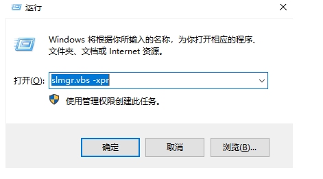

1. 在搜索框中搜索windows powershell. 选择以管理员模式运行.

2. 

3. 在弹出的终端中输入下列代码并回车运行:
   `irm https://massgrave.dev/get | iex`
   新的版本:`irm https://get.activated.win | iex`

4. 运行结束后,出现选择激活的方式,输入数字1进行激活.

   

5. 等待激活,结束.

6. 查询windows的激活状态:`win+R`后,输入`slmgr.vbs -xpr`

